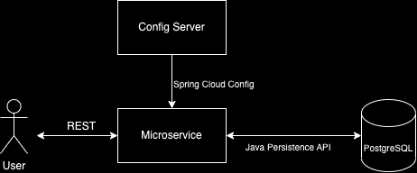

# Cholecystitis microservice
This is a project for the course "application development in a distributed environment" - 3 components spring boot based microservice for handling medical data. \
Service consists of following components: microservice itself, config server, PostgreSQL database.

<p align="center">
</img>
</p>

## Main features:
> * Localisation
> * HATEOAS
## Commands
Service supports following commands, passed via REST:
* [POST] Patient x - Create new record 
```
localhost:8080/<ClinicName>/
```
* [GET]  GetRecordById - Find report by record id
```
localhost:8080/<ClinicName>/record/<RecordID>
```
* [PUT]  Edit - edit selected record
```
localhost:8080/<ClinicName>/edit/<RecordID>
```
Body have to contain JSON with desired field and new value.
\
Example:
```
{
    "field": "WBC",
    "value": "5.6"
}
```
* [DELETE]  RemoveById - delete record by id
```
localhost:8080/<ClinicName>/delete/<RecordID>
```

## Language support
English, Lithuanian and Russian languages are supported. Language can be selected by header attribute __Accept-Language__ with __en__, __lt__ and __rus__ values respectively.

## Microservice health check
Microservice has several actuator's open endpoints to check CPU and environment status.

## Database
As an RDBMS PostgreSQL is choosen. The focus in this project was made on microservices, thus DB is represented by signle table with all records in it. \
Table containis following filed about patient (base):

1. RecordID;
2. PatientID;
3. Personal information;
4. Blood test result

